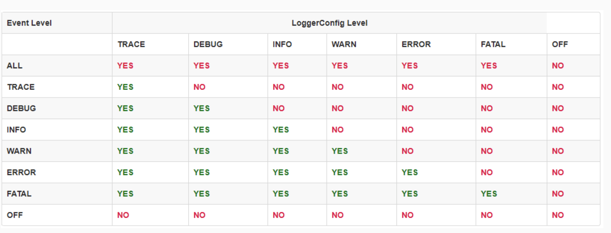

# Spring Boot Log Level Demo

Spring Boot demonstration for logging level change using actuators.

---
## Justification

Log level is an indicator that capture the importance/urgency of all the log entries.
Usually, we only want to capture certainly type of entries depending on which environment we are working on.

The following table illustrate the log level hierarchy. 

This demonstration using Spring Boot actuators allow us to change the log level indicator on runtime.

---
## Requirements

* Docker 24.0.6
* Make 3.81
* Java 21
* Maven 3.9.5

---
## Run

```bash
source .env; \
mvn clean install; \
java \
-Dserver.port=${APPLICATION_PORT} \
-jar target/${APPLICATION}.jar
```
or
```bash
mvn clean install; \
make docker.start
```

---
## Demonstration

### Previous configuration

Loggers actuators should be enabled and exposed.
```yml
management:
  endpoint.loggers.enabled: true
  endpoints.web.exposure.include: loggers
```

### Get current log level

```bash
source .env; \
curl "http://localhost:${APPLICATION_PORT}/actuator/loggers/com.eightaugusto.spring.boot.log.demo"
```

### Change current log level

```bash
source .env; \
curl "http://localhost:${APPLICATION_PORT}/actuator/loggers/com.eightaugusto.spring.boot.log.demo" \
--header "Content-Type: application/json" \
--data "{\"configuredLevel\": \"${LOG_LEVEL:-trace}\"}"
```

### Trigger logs

```bash
source .env; \
curl -X GET "http://localhost:${APPLICATION_PORT}/v1/example"
```

### Example logs

The following logs is an example output based on the default configured LOG_LEVEL (default 'trace').
Changing the LOG_LEVEL will show different outputs depending on the previous table.
```bash
2024-01-01T00:00:00,00 [spring-boot-log-level-demo] FATAL [http-nio-8080-exec-1] c.e.s.b.l.d.e.c.ExampleController.getExample:15 - Fatal
2024-01-01T00:00:00,00 [spring-boot-log-level-demo] ERROR [http-nio-8080-exec-1] c.e.s.b.l.d.e.c.ExampleController.getExample:16 - Error
2024-01-01T00:00:00,00 [spring-boot-log-level-demo] WARN  [http-nio-8080-exec-1] c.e.s.b.l.d.e.c.ExampleController.getExample:17 - Warn
2024-01-01T00:00:00,00 [spring-boot-log-level-demo] INFO  [http-nio-8080-exec-1] c.e.s.b.l.d.e.c.ExampleController.getExample:18 - Info
2024-01-01T00:00:00,00 [spring-boot-log-level-demo] DEBUG [http-nio-8080-exec-1] c.e.s.b.l.d.e.c.ExampleController.getExample:19 - Debug
2024-01-01T00:00:00,00 [spring-boot-log-level-demo] TRACE [http-nio-8080-exec-1] c.e.s.b.l.d.e.c.ExampleController.getExample:20 - Trace
```